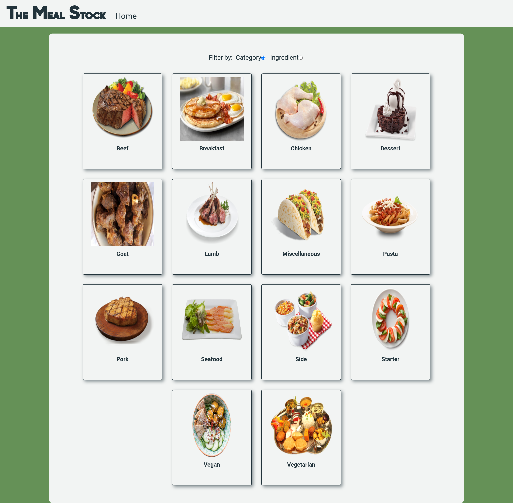

# The Meal Stock

> This is website where you can search for recipes from different parts of the world by category or ingredient. It is built in React-Redux. This is following the "Catalogue of Dog Clothes guideline".



## Live Demo

[The Meal Stock Demo](https://the-meal-stock.netlify.app/)

### Built With

This project was built using these technologies.

- ReactJS
- Prop-Types
- Redux
- React-Redux
- HTML / SASS
- NodeJS
- Testing-Library
- Redux-mock-store

### Getting Started

To get a local copy up and running follow these simple example steps.

### Prerequisites

- A web browser
- Node.js
- A terminal

### Clone

- Clone with SSH:

```
git@github.com:jadx2/the-meal-stock.git
```

- Clone with HTTPS:

```
https://github.com/jadx2/the-meal-stock.git
```

- Move to the temporary feature branch:

```
git checkout the-meal-stock
```

### Usage

- Install dependencies with yarn:

```
  yarn
```

- Run server:

```
  yarn start
```

- If it doesn't open automatically paste the following in your browser:

```
  http://localhost:3000/
```

### Testing

- To test the app run the command for test in the root directory of the project:

```
yarn run test
```

## Contributors

👤 **Jaim Delmar**

- Github: [@jadx2](https://github.com/jadx2/)
- Twitter: [@thecatcodes](https://twitter.com/thecatcodes)
- LinkedIn: [@Jaim Delmar](https://www.linkedin.com/in/jaimdelmar/)

## :handshake: Contributing

Contributions, issues and feature requests are welcome!

Feel free to check the [issues page](https://github.com/jadx2/the-meal-stock/issues).

## Show your support

Give a :star: if you like this project!

## 📝 License

This project is [MIT](https://opensource.org/licenses/MIT) licensed.
